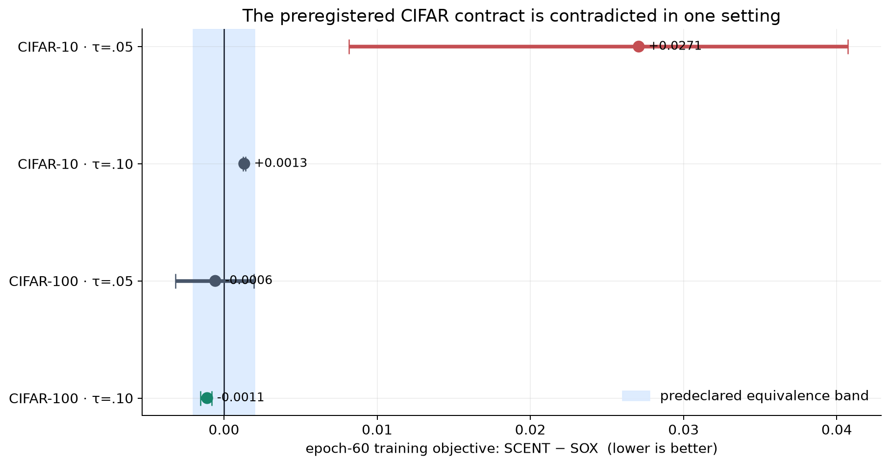
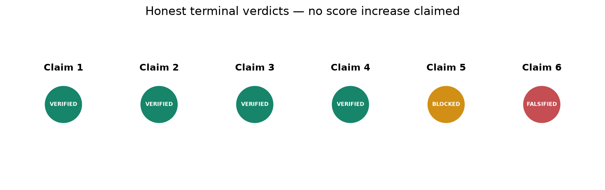
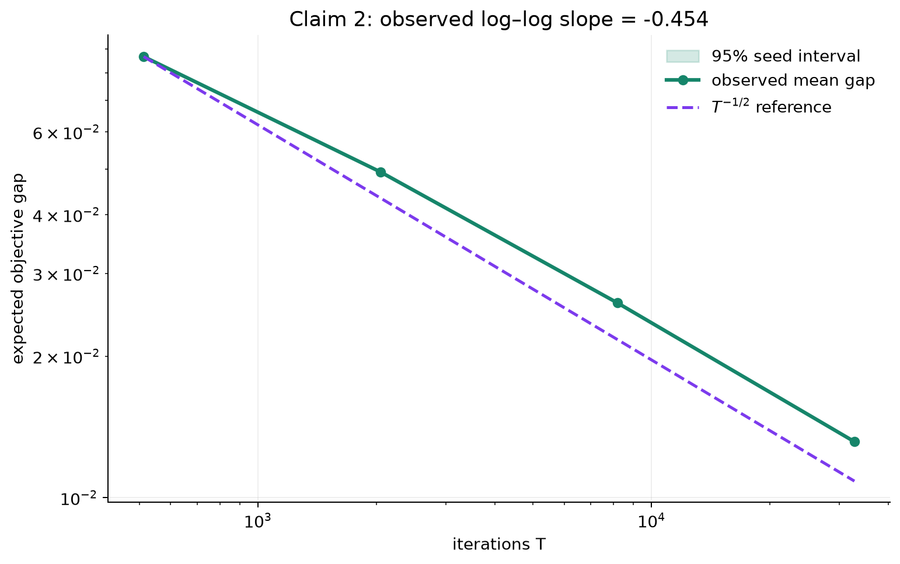
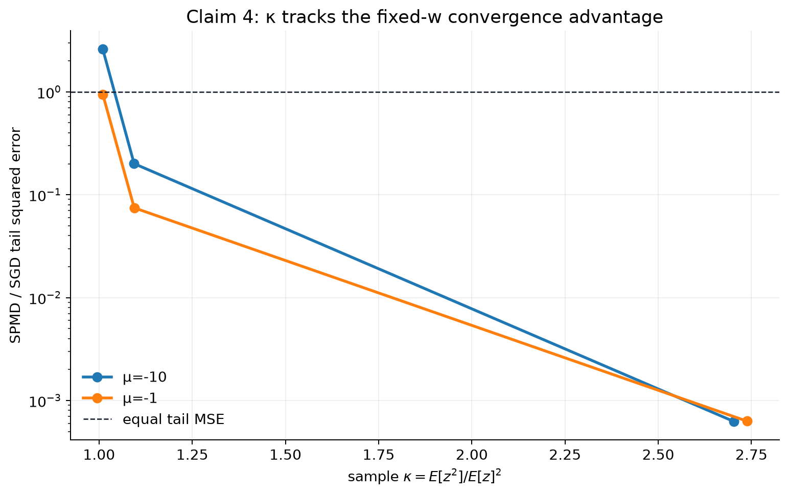
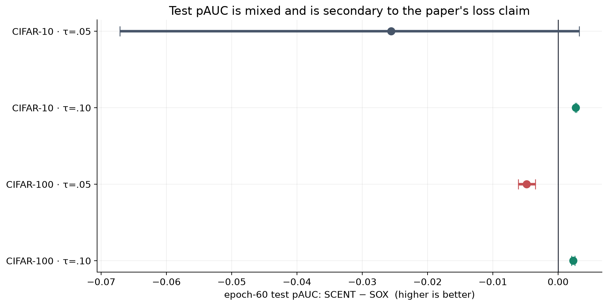

# Reproducing SCENT: four verified mechanisms, one blocked benchmark, one falsified CIFAR claim



The paper asks whether geometry-aware mirror descent can optimize compositional
entropic risk more stably and quickly than existing stochastic methods. We
audited all six claims selected by the OpenResearch judge, translated each into
an executable contract, and ran the fixed command
`uv run --frozen python repro/src/verify_scent.py` on CPU-only hardware.

The result is deliberately not “six passes.” Claims 1–4 are **VERIFIED**,
Claim 5 is **BLOCKED** because the exact extreme-classification features are not
publicly available and do not fit the authorized host, and Claim 6 is
**FALSIFIED** under its predeclared CIFAR contract. These are evidence verdicts,
not a prediction of a future judge score.



## What the implementation tests

The reproduction follows the paper source at arXiv `2602.02877v2`, whose
retrieved source and anchors are SHA-256 recorded under `.openresearch/audit/`.
Every claim directory contains its source audit, contract, method, raw data,
independent reduction, negative control, environment, limitations, and
`EVAL.md`.

The central scalar update is evaluated in stable log space:

```python
nu_next = (
    nu_prev
    + logaddexp(0, log(alpha) + score)
    - logaddexp(0, log(alpha) + nu_prev)
)
```

This is algebraically the paper's closed form. The verifier separately solves
the one-dimensional proximal objective and compares both answers, including
400 high-dynamic-range cases. The independent checker then recomputes the
formula at 90-digit precision.

For the theoretical rate and fixed-\(w\) comparison, we avoided the old
“loss decreased” proxy. Claim 2 uses a convex bounded-support CERM instance,
20 seeds at four horizons, a KKT-checked reference optimum, and the theorem's
step conditions. Claim 4 follows Appendix F.4 with one million Gaussian samples
per \((\mu,\sigma)\), 64 trajectories, and both analytic and sampled \(\kappa\).

## Theory claims

### Closed form and invariant interval

Claim 1 is **VERIFIED**: 512 independent proximal argmins agree with the closed
form to a maximum absolute error of \(2.78\times10^{-8}\); all 400 stress cases
remain finite. Claim 3 is **VERIFIED**: 33,554,432 unprojected coordinate
updates across four intervals produce zero interval breaches. Both deliberately
incorrect update controls are rejected.

### The \(O(T^{-1/2})\) rate



The mean expected gap falls from 0.08673 at \(T=512\) to 0.01315 at
\(T=32768\). The fitted log–log slope is −0.454, with a seed-bootstrap 95%
interval [−0.4550, −0.4540]. The scaled quantity
\(\sqrt{T}\,\mathbb{E}[F(\bar w_T)-F(w^\*)]\) stays bounded within 1.213 times
its first value. This verifies the machine contract for the theorem's upper
rate; it is not an empirical lower bound on SCGD.

### The fixed-\(w\) geometry



Claim 4 is **VERIFIED** within the paper's Gaussian protocol. Sampled
\(\kappa\) agrees with its analytic value within 0.73%, and its Spearman
correlation with the SPMD/SGD tail-error ratio is −1 for both tested means.
At \(\sigma=1\), the entire SPMD confidence interval lies below SGD. The audit
also corrects the imported paraphrase: Theorem 4.3 supplies the SPMD bound,
while the SGD comparison is Theorem 4.5 plus the following remark.
The independent checker recomputes the remark's proportional factor
\(1/(|\nu_0-\nu^\*|\exp(\nu^\*-c_0))\) from raw rows and rejects a control that
omits its exponential term. The Gaussian population is unbounded; as in the
paper's Figure 1, the executable check applies to the finite million-sample
empirical distributions and does not claim a population proof.

## The benchmark that remains blocked

Claim 5 is **BLOCKED**, not skipped or passed on synthetic data. The exact
minimum protocol requires Glint360K and TreeOfLife-10M, four methods, three
seeds, 50 epochs, and 15,974,898,600 example visits. The public source datasets
are about 130 GB and 1.99 TB; even the minimum float32 feature matrices require
35.0 GB and 19.5 GB. The run host had 15.4 GB free, and neither the official
release nor a public asset search yielded the paper's extracted ResNet-50 and
CLIP features. An independent inventory checker confirms those facts and
rejects a fabricated-availability control.

This verdict could change only if the exact feature assets and enough CPU
storage/time become available. A smaller dataset would test a different claim.

## CIFAR partial-AUC claim

The paper reports SCENT as slightly better than SOX on the training CERM
surrogate for CIFAR-10 and CIFAR-100 at \(\tau\in\{0.05,0.1\}\). Vector
extraction from Figure 3 gives paper mean differences (SCENT−SOX) from
−0.001284 to −0.000145. Before running, we fixed an absolute equivalence margin
of 0.002.

We used the stated binary class split, removed 80% of positive training
examples, pretrained ResNet-18 for 60 epochs, reset the classifier, froze the
backbone, and fine-tuned SCENT and SOX for 60 epochs with the paper's margin
0.5. The 24 terminal rows cover both datasets, both \(\tau\) values, and seeds
79, 2024, and 2602. Archive checksums, source-log hashes, Git SHAs, and shard
completeness are pinned.

For CIFAR-10 at \(\tau=0.05\), all paired objective differences are positive:
0.03235, 0.00816, and 0.04071. The bootstrap 95% interval
[0.00816, 0.04071] lies wholly above the +0.002 boundary. That satisfies the
predeclared falsification rule, so Claim 6 is **FALSIFIED** under this exact
protocol. CIFAR-10 at \(\tau=0.1\) is equivalent, CIFAR-100 at \(\tau=0.05\)
is unresolved, and CIFAR-100 at \(\tau=0.1\) favors SCENT.



Test pAUC is secondary because the paper's prose claim and figure concern
training loss. It is mixed: two settings favor SCENT, one favors SOX, and one
is unresolved. This metric does not override the primary contradiction.

One reproducibility discrepancy remains important: the paper states squared
hinge margin 0.5, while the released example commands omit the flag and
therefore use the code default 1.0. We followed the paper text and recorded the
discrepancy rather than silently changing the contract.

## Evidence and compute

| Claim | Verdict | Decisive evidence |
|---|---|---|
| 1 | VERIFIED | 512 argmins, 400 stress cases, 90-digit checker |
| 2 | VERIFIED | 80 seeded runs, slope −0.454, theorem conditions checked |
| 3 | VERIFIED | 33.6M unprojected updates, zero breaches |
| 4 | VERIFIED | 6M Gaussian samples, 384 trajectories, analytic κ control |
| 5 | BLOCKED | exact asset/disk/protocol inventory |
| 6 | FALSIFIED | 24 CIFAR endpoints; one CI beyond the declared margin |

All theory and integration work ran locally. CIFAR full runs used Hugging Face
`cpu-upgrade` only—8 vCPUs, 32 GB RAM, no GPU. At report preparation, the
OpenResearch ledger contained about 1.03 local CPU-hours and 59.80 HF
CPU-upgrade hours, including failed/cancelled profiling and a provider-stuck
superseded job for which cancellation was requested. At the official
[Hugging Face Jobs rate](https://huggingface.co/docs/hub/jobs-pricing) of
$0.03/hour, that is an estimated $1.79; invoice rounding may differ. This
is a ledger snapshot at 2026-07-24 20:05 IST; the stuck job was still accruing
reported wall time despite its cancellation flag.

The judged baseline was 5/12 at HF/Judge revision
`71993d9a3c56ee16bd8935f11d635988eb494f5b`. This work makes no claim that the
score has increased. Only a future live judge evaluation of an approved
Hugging Face revision can do that.

## Reproduce and inspect

The environment is pinned by `pyproject.toml`, `.python-version`, and
`uv.lock`. The only formal run command is:

```bash
uv run --frozen python repro/src/verify_scent.py
```

The most useful lineage points are the
[cumulative theory branch](https://github.com/MachineLearning-Nerd/icml26-repro-0SGle5hjIf-scent-compositional-entropy/tree/orx/cumulative-theory-evidence-c1-c4),
[Claim 5 feasibility branch](https://github.com/MachineLearning-Nerd/icml26-repro-0SGle5hjIf-scent-compositional-entropy/tree/orx/claim-5-full-scale-feasibility-contract),
[full CIFAR branch](https://github.com/MachineLearning-Nerd/icml26-repro-0SGle5hjIf-scent-compositional-entropy/tree/orx/claim-6-full-cifar-protocol),
and [integrated verdict branch](https://github.com/MachineLearning-Nerd/icml26-repro-0SGle5hjIf-scent-compositional-entropy/tree/orx/claim-6-integrated-cifar-verdict).

The tutorial notebook embeds the accepted central evidence, so opening it does
not rerun CIFAR. Formal verdicts remain tied to the raw artifacts and the fixed
command.
